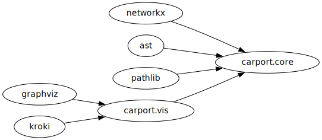

# Carport


<!-- WARNING: THIS FILE WAS AUTOGENERATED! DO NOT EDIT! -->

Dependen**c**y Gr**a**ph f**r**om **P**ython imp**ort**s (CARPORT).

[](https://pypi.org/project/carport/)

<!--  -->


<!--  -->
<!--  -->

<!--  -->

## Installation

``` sh
pip install carport
```

## Usage

``` python
from carport.core import ImportGraph

depg = ImportGraph(root = '..', project='carport')
# vars(depg)
```

``` python
# specify irrelevant modules
ignore_nodes = ['io', 'IPython', 'pprint', 'subprocess']
```

``` python
# export to dot string
dot = depg.to_dot(ignore_nodes=ignore_nodes)
display(dot)
```

    'digraph  {\n"carport.vis";\n"carport.core";\npathlib;\nnetworkx;\nast;\ngraphviz;\nkroki;\n"carport.vis" -> "carport.core"  [key=0];\npathlib -> "carport.core"  [key=0];\nnetworkx -> "carport.core"  [key=0];\nast -> "carport.core"  [key=0];\ngraphviz -> "carport.vis"  [key=0];\nkroki -> "carport.vis"  [key=0];\n}\n'

``` python
# draw graph with graphviz
dotg = depg.draw_dot(ignore_nodes=ignore_nodes)
display(dotg)
```



``` python
# export to d2 string
d2 = depg.to_d2(ignore_nodes=ignore_nodes)
display(d2)
```

    '\n        vars: { \n            d2-config: { \n                layout-engine: elk \n                } \n            }\n        direction: right\n        **.style.border-radius: 99\n        *.style.font: mono\n        \ngraphviz -> carport.vis\npathlib -> carport.core\nIPython -> carport.vis\nsubprocess -> carport.vis\nkroki -> carport.vis\nnetworkx -> carport.core\ncarport.vis -> carport.core\nio -> carport.core\nast -> carport.core\nio: null\nIPython: null\npprint: null\nsubprocess: null'

``` python
from IPython.display import HTML

# draw graph with d2 or kroki
d2g = depg.draw_d2(ignore_nodes=ignore_nodes)
display(d2g)
```


TODOs:

\[\] imports concerning `__init__.py`

\[\] `py_d2` to d2 (like `graphviz` to graphviz)

## Related

import-deps: [Github](https://github.com/schettino72/import-deps)

pydeps: [Github](https://github.com/thebjorn/pydeps)

snakefood3: [Github](https://github.com/Trim21/snakefood3)

kroki: [online editor](https://kroki.io/),
[python-interface](https://github.com/thorwhalen/kroki)

D2: [doc](https://d2lang.com/tour/text), [online
editor](https://play.d2lang.com/),
[python-interface](https://github.com/MrBlenny/py-d2)

## Statistics

<!--  -->


<!--  -->

## Copyright

Copyright © 2024 onward Felidz. All rights reserved, with certain parts
of the project specifically licensed and subject to different terms and
conditions, e.g., source code of the project under the Apache-2.0
license; you may not use this project except in compliance with the
license.

## Citation

BibTeX citation:

``` bibtex
@misc{felidz2024,
  author = {Felidz},
  title = {Carport},
  year = {2024},
  publisher = {GitHub},
  journal = {GitHub repository},
  howpublished = {\url{https://github.com/felidz/carport}}
}
```
